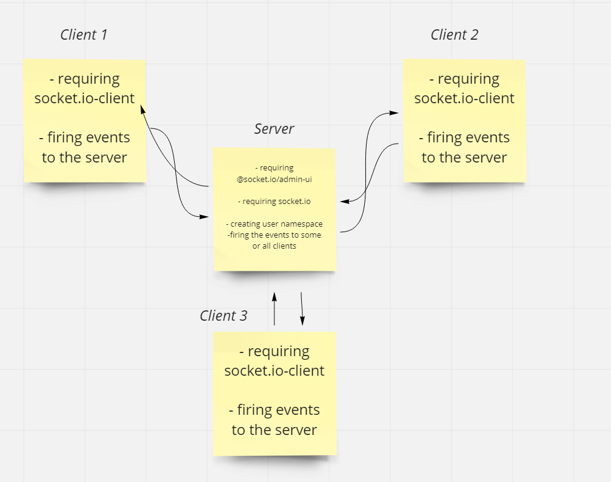

# class13socket.io

# Desicrption
* did an application called `class13socket.io` to contact client with each others using messages. I used socket.io and socket.io-client to link between server and clients.

* Createed an html flie that contains a form which sends messages from the client(user) and joins to a room.

* creating socket.io connection.

* build the application using `socket.io`, `socket.io-clent`, `@socket.io/admin-ui`, and `snowpack`. They were used to fire events from the client to the server, also from the server to the clients. 

* You can run it by running `node server.js` on server side and then `npm run start ` on client side and after that it will open a chrome or whatever default broswer your PC has, on port `8080` and from their you can open mutliple tabs and send messages in the message section, also you can join rooms to send private messages to same clients who are connected on the same room.

* You can open multiple browsers by opening new tab and writing `localhost:8080` and you can chat with others by writing in the `message` section and there is also send `private messages` in the rooms by joining (connecting) the same room then write messages there and it will be sent only to people who are connected to that room

# UML

# links

- [pull request](https://github.com/islam-Attar/class13socket.io)
